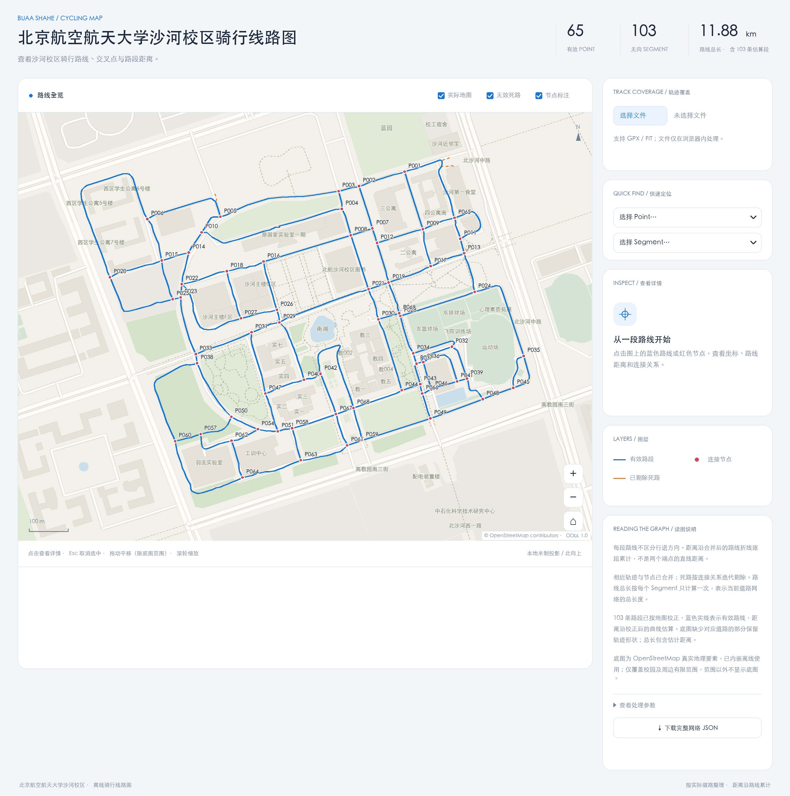
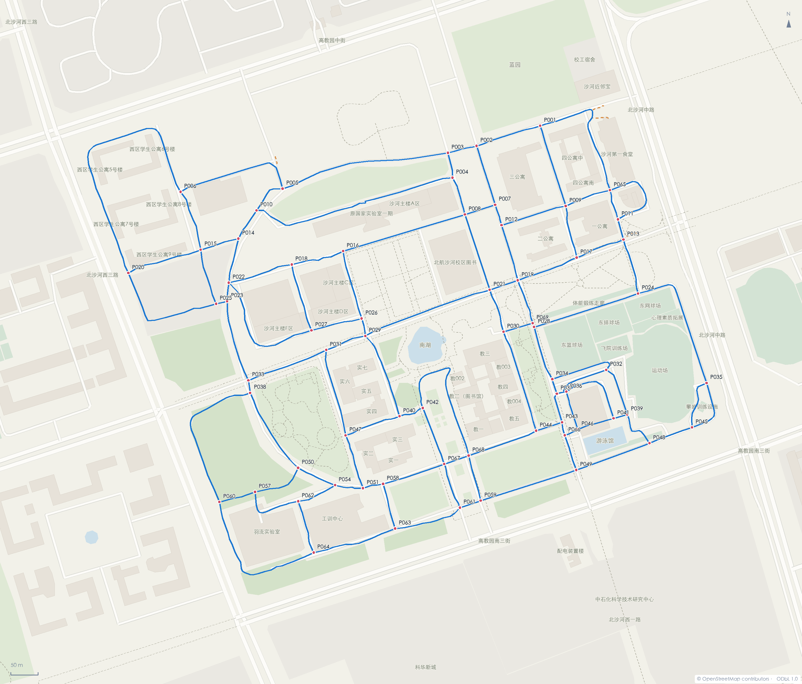

# 北京航空航天大学沙河校区骑行线路图

北航沙河校区的离线交互骑行线路图，展示校区骑行路线、交叉点和路段距离。目前包含 **65 个交叉点、103 条无向路段**，组成一个连通网络。每条路段只计算一次时，路线总长约 **11.884 千米**。

## 示例展示

以下 PNG 根据当前路网、底图和页面浅色样式离线绘制，用于静态展示；界面图不是浏览器截图，实际交互和布局以 HTML 页面为准。

### 页面界面



### 纯地图



## 打开地图

下载或克隆仓库，在浏览器中打开 [`route_network.html`](route_network.html)。也可以在 GitHub 选择 **Code → Download ZIP**，解压后打开该文件。

页面已内嵌底图和路网数据，无需安装依赖、启动服务或申请地图 API Key。支持缩放、拖动、点线选择与详情、图层开关，以及下载完整网络 JSON。地图移动和缩放限制在已有底图范围内。

GitHub 文件页展示 HTML 源码，下载后打开即可使用交互地图。更新本地文件后，刷新页面查看新版本。

## 上传轨迹与覆盖统计

在侧栏选择 `.gpx` 或 `.fit` 文件，将轨迹对应到当前路网。文件仅在浏览器内解析，不上传至服务器，不写入仓库，也不保存在浏览器存储中。支持包含 GPS 坐标的 FIT、GPX 轨迹段及路线；纯航点列表无法分析。坐标应为 WGS84。单个文件上限 20 MB、100,000 个坐标点。

正常地图不显示预置轨迹。上传有效文件后，页面显示「上传轨迹」开关及图例，轨迹默认隐藏；手动勾选后可查看高对比的紫红色虚线轨迹，并可随时取消勾选隐藏该图层，取消后会清除轨迹与对应控件。断开的轨迹段不会用直线连接。

页面显示覆盖的 Point、Segment 数量及占整个路网的百分比，以及包含重复经过的累计路段里程。路段不区分方向，往返分别计次；经过 **1 次为绿色、2 次为黄色、3 次及以上为红色**，仅经过 3 次及以上的路段显示数字次数标签，绿色和黄色路段不显示数字。深灰色虚线表示未覆盖路段，与底图灰色区分；深色主题使用更亮的灰色保证对比。选中路段可查看经过次数，选中节点可查看是否覆盖。

匹配综合使用与路线的距离和路网连接关系，候选范围为 25 米。一次单向行进中的有效匹配部分累计覆盖至少 80% 的路段才计一次，允许同一路段中部的短暂 GPS 偏移后接续；偏移期间没有匹配到的路线不增加有效覆盖比例。较短的局部经过不计入路段覆盖。节点在匹配路线到达距端点不超过 12 米（且不超过路段长度的 20%）时计为覆盖。同一路段中部的偏移最多允许 12 个未匹配采样、30 秒、80 米累计移动；重返时距偏移前位置不超过 40 米、沿路段进度差不超过 20 米。轨迹分段、无有效坐标、较长离路、超过 100 米的采样跳跃或超过 120 秒的时间间隔会断开匹配，不跨越真正断开的数据推算路线。

**累计路段里程 = Σ（路段 `length_m` × 经过次数）**。这是按路网估算的里程，包含重复通过，不能代替文件中的实测活动里程；少量起终点缺失在满足 80% 阈值时仍按完整路段计长。GPS 漂移、相邻道路、稀疏采样与路网误差可能影响结果。可点击「取消并返回」中止分析或清除结果，恢复上传前的地图位置、图层开关和选择。

## 基本概念

- **交叉点（point）**：多条路段共用的连接位置。每个点至少连接两条不同路段；当前网络中的点均连接 3 或 4 条路段。
- **路段（segment）**：连接两个交叉点的一条完整路线，用一组有序坐标描述道路形状。路段无向，端点 A、B 只表示坐标的存储顺序。同一对交叉点之间可以有多条不同路线。
- **路口连接**：相连路段共用完全相同的端点坐标；路口附近尽量直线接入，同时保留道路本身的转弯。
- **路段距离**：沿折线逐段累计的 WGS84 椭球面距离，单位为米，不是两个端点的直线距离，也不包含海拔起伏。
- **网络总长**：将每条有效路段的长度各计算一次。重复经过同一路段不会增加网络总长。
- **估算精度**：地图上的位置、形状和距离均可能存在误差；小数位数不代表对应的测量精度。

## 字段约定

经纬度统一使用 **WGS84（EPSG:4326）**，坐标数组按 **`[经度, 纬度]`** 存储。

### 交叉点

| 字段 | 含义 |
| --- | --- |
| `id` | 交叉点编号，例如 `P019` |
| `longitude` / `latitude` | 经度与纬度 |
| `x_m` / `y_m` | 局部平面坐标，单位为米 |
| `degree` | 相连的不同路段数量 |
| `segment_ids` | 与该点连接的路段编号列表 |
| `kind` | 节点类型，`junction` 表示交叉点 |

### 路段

| 字段 | 含义 |
| --- | --- |
| `id` | 路段编号，例如 `S100` |
| `point_a` / `point_b` | 两端的交叉点编号，分别对应折线的首、尾坐标 |
| `directed` | 是否有向；当前网络均为 `false` |
| `coordinates` | 按顺序排列的完整经纬度折线 |
| `geometry_xy` | 同一折线的局部平面坐标，单位为米 |
| `coordinate_count` | 折线坐标点的数量 |
| `length_m` | 沿折线累计的路线距离，单位为米 |
| `geometry_is_estimate` / `length_is_estimate` | 形状或距离是否为估算值 |

`x_m`、`y_m` 和 `geometry_xy` 使用 UTM 50N（EPSG:32650）局部坐标。加上 `metadata.local_xy_origin_utm_m` 中的原点偏移，即得到对应的完整 UTM 坐标。

点与路段的编号不要求连续，已停用的编号不会重复使用。`degree` 按不同路段编号计数，不按相邻交叉点数量计数。

## 主要文件

| 文件 | 内容 |
| --- | --- |
| `route_network.html` | 完整离线交互页面 |
| `interface.png` / `map.png` | 页面界面与纯地图的静态示例图 |
| `route_network.json` | 路网数据及元数据 |
| `route_network.geojson` | 可导入 GIS 的交叉点与路段要素 |
| `points.csv` / `segments.csv` | 节点坐标、连接关系、路段距离与折线 |
| `map_basemap.json` / `map_basemap.geojson` | 离线底图数据 |
| `validation.json` | 数据一致性与网络结构检查结果 |
| `build_viewer.py` | 根据当前 JSON 数据与脚本重新生成页面 |
| `track_analysis.js` / `track_upload.js` | 轨迹解析、路网匹配及上传交互；构建时嵌入 HTML |
| `track_analysis.test.js` | 使用合成轨迹验证解析与覆盖统计 |

## 重新生成页面

需要 Python 3，仅使用标准库：

```sh
python3 build_viewer.py
```

脚本读取仓库根目录的 `route_network.json`、`map_basemap.json` 和两个轨迹功能脚本，生成根目录的 `route_network.html`。它只构建页面，不会修改路网。打开生成的 HTML 无需额外 JS 文件或依赖。

轨迹逻辑测试需要 Node.js，无第三方依赖：

```sh
node --test track_analysis.test.js
```

## 地图署名

© [OpenStreetMap contributors](https://www.openstreetmap.org/copyright)，采用 [ODbL 1.0](https://opendatacommons.org/licenses/odbl/1-0/) 许可。页面保留来源署名；正常打开、缩放和查看详情无需联网，外部版权链接仅在点击时打开。
