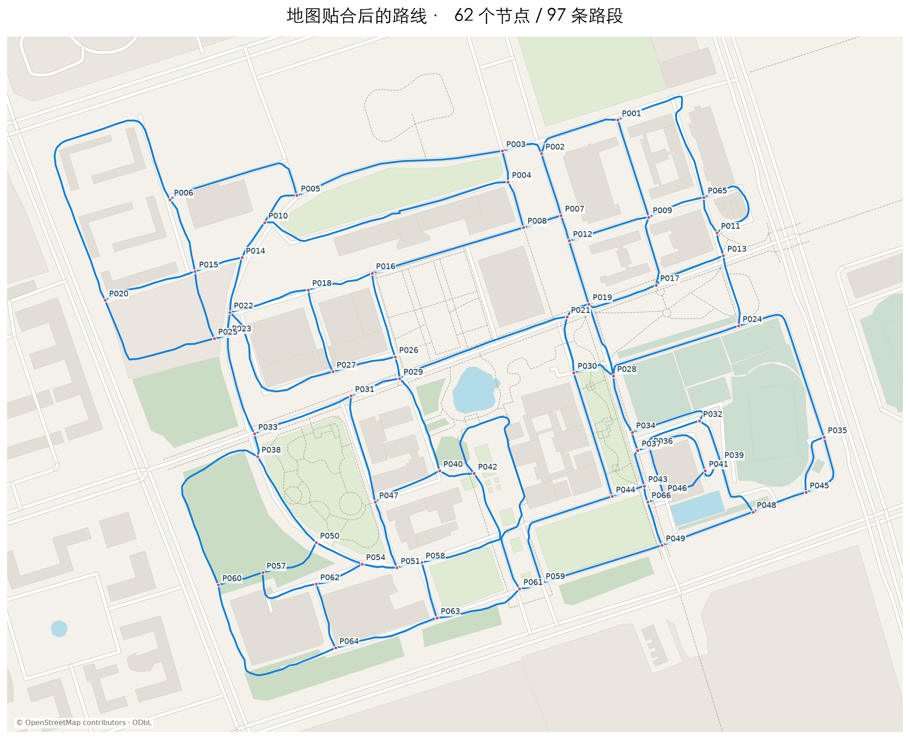

# 北京航空航天大学沙河校区线路图

北航沙河校区的离线交互线路图，展示校区道路、交叉点和路段距离。目前包含 **62 个交叉点、97 条无向路段**，组成一个连通网络。每条路段只计算一次时，路线总长为 **11,785.19 米（约 11.785 千米）**。

## 打开地图

下载或克隆仓库，在浏览器中打开 [`route_network.html`](route_network.html)。也可以在 GitHub 选择 **Code → Download ZIP**，解压后打开该文件。页面已内嵌地图与数据，无需安装依赖、启动服务或申请地图 API Key。

页面支持缩放、拖动、点线选择与详情、图层开关，以及下载完整网络 JSON。有效路段用蓝色实线展示；原始 GPS 轨迹默认隐藏，可打开图层进行对比。鼠标拖动、缩放、键盘平移和窗口尺寸变化均受已有底图范围约束。

GitHub 文件页展示 HTML 源码，下载后打开即可使用交互地图。更新本地文件后，刷新页面查看新版本。



## 如何理解线路与距离

- 所有路段均无向，可以从任一端理解其连接关系。同一对交叉点之间可以有多条不同路线，不会仅因端点相同就合并。
- 每个交叉点至少连接两条不同路段；当前网络中的点均连接 3 或 4 条路段，有效网络中没有死路节点。
- 路段保存完整折线，距离沿折线逐段累计，不是两端的直线距离。
- 路口端部尽量采用直线接入，局部调整范围不超过每端 18 米、路段长度的 30%，形状偏移不超过 3 米；实际道路转弯与路段中部保留。
- 路网总长是所有有效路段各计一次的长度，不是某次活动的累计里程。
- 当前几何形状与距离经过地图和人工标注校正，属于估算。小数位数不代表相应的测量精度。
- P019–P028 的 S100 已由使用者确认实际可通行，以蓝色实线显示；其形状仍属于估算，当前长度为 112.82 米。

## 地图校正与已知局限

手绘标注路线及其交叉点优先于自动地图匹配。标注卫星图通过地面路口和对应道路特征配准到局部米制坐标，再转换为 WGS84；高德地图的图像像素或 GCJ-02 坐标不能直接当作 WGS84 使用。图像配准和人工标注仍存在误差。

普通路段综合沿线采样、道路方向与局部连续性匹配底图，候选位置的最大偏移为 18 米。交叉点优先匹配附近分支方向一致的路口，相连路段共用完全一致的端点坐标。如果贴合会引入不应存在的交叉，则局部降低贴合强度，保留相邻但不同的道路和真实环路。

当前仍有以下匹配限制：

- **S066、S068**：底图中没有对应道路，保留原有路线形状并重新连接共享端点。
- **S004**：仅部分匹配到底图，覆盖率与状态记录在 `map_alignment` 字段中。

这份线路图是根据活动轨迹和地图证据整理的代表性路网，不属于测绘成果。底图缺失或标注误差可能影响局部形状和距离。

## 数据文件

| 文件 | 内容 |
| --- | --- |
| `route_network.html` | 完整离线交互页面 |
| `route_network.json` | `metadata`、`points`、`segments`、`removed_dead_ends` 和 `raw_track`，包含当前网络、来源记录与原始 GPS 采样 |
| `route_network.geojson` | 当前有效网络的 Point 与 LineString 要素，可导入 GIS |
| `points.csv` | 节点坐标、度数和相连路段 ID |
| `segments.csv` | 路段端点、沿线距离、坐标数量、支持采样、WKT 几何和来源记录 |
| `map_basemap.json` / `map_basemap.geojson` | 本区域离线 OpenStreetMap 底图 |
| `removed_dead_ends.geojson` | 初始提取时剔除的 4 条死路，仅供历史核查，不属于有效网络 |
| `validation.json` | 当前坐标、拓扑与距离验证；其中 `historical_pre_correction_audit` 仅适用于早期版本 |
| `scripts/build_viewer.py` | 从当前 JSON 数据重新生成页面 |

预览图用于查看全网或特定校正区域：

| 文件 | 内容 |
| --- | --- |
| `network_with_map.png` | 当前网络叠加实际底图 |
| `network_overview.png` | 当前网络与原始 GPS 轨迹对比 |
| `map_corrections_preview.png` | 较早的四处局部校正预览 |
| `latest_refinements_preview.png` | P008 和游泳馆西侧区域的后续调整 |
| `inferred_S100.png` | 已确认可通行的 P019–P028 连接局部图 |
| `junction_approaches_preview.png` | 路口端部拉直前后对比 |

## 字段与坐标约定

| 字段或概念 | 说明 |
| --- | --- |
| 经纬度 | 使用 WGS84（EPSG:4326），数组顺序为 `[经度, 纬度]` |
| `geometry_xy` | 使用 UTM 50N（EPSG:32650）米制坐标，数值相对于 `metadata.local_xy_origin_utm_m` 所记录的原点 |
| 路段的 `coordinates` | 保存按顺序排列的完整折线坐标 |
| `point_a` / `point_b` | 定义折线坐标的存储顺序，不表示通行方向；所有路段均无向 |
| `length_m` | 相邻折线顶点之间的 WGS84 椭球面距离之和，单位为米；不是端点直线距离，也不包含海拔起伏 |
| `degree` | 相连的不同路段 ID 数量；同一对端点之间允许存在几何形状不同的多条路段 |
| `is_user_corrected` | 标记按使用者要求进行的地图校正 |
| `geometry_method` | 记录几何构建方法，区分图像配准、交叉点细化、普通底图匹配、路口端部拉直等 |
| `junction_straightening` | 记录路口端部拉直的范围、偏移和先前的几何构建方法 |
| `geometry_is_estimate` / `length_is_estimate` | 标记形状或距离为估算值，小数精度不等于实际准确度 |
| `supporting_gps_record_indices` | 从 0 开始的 `raw_track` 采样索引，不是全部 FIT 消息的索引 |
| S100 的 `is_inferred` | 描述这条补充路段几何的初始来源；其连接已由使用者确认，当前构建方法见 `geometry_method` |
| 停用 ID | 已删除的点和路段 ID 不重复使用；停用 ID 与区域校正历史保存在元数据中 |

受校正影响的 GPS 采样会在 18 米范围内重新归属到最近路段。采样靠近某条路段，仅提供位置支持，不能证明活动完整经过了整条校正后的路线。

## 数据来源与隐私

本仓库包含地理位置与活动轨迹，应按私有数据管理。原始 FIT、手绘标注截图、心率等活动消息和本地调试环境未纳入仓库；派生几何、来源文件名等来源记录仍然保留。

原始 GPS 采样、历史死路和早期审核记录均保留供核查。路网几何校正没有修改原始活动采样；`network_overview.png` 也展示了原始轨迹。

## 提取方法与校正历史

### 初始轨迹提取

源 FIT 包含 3,662 个有效 GPS 采样，记录的活动距离为 16,680.50 米。GPS 折线长度与 FIT 活动计距采用不同的计算方式，不应混为一谈，也不能与当前路网总长直接等同。

初始处理使用 5 米轨迹缓冲、1 米栅格中心线、窄间隙合并、紧凑交叉点聚类和迭代死路剔除。约 10 米的合并容差生成了 64 个点、99 条路段，这是加入 S100 和后续地图校正之前的结果。

`metadata.sensitivity` 中的 8／10／12 米容差实验只适用于初始提取阶段，不代表当前人工校正后网络的敏感性验证。

### 已完成的地图校正

1. 将 P030 北移到标注路口，并重新连接 P021、P028、P044。
2. 拆分 S003 与 S017，添加四岔路口 P065 和新路段 S101、S102。P065–P011 之间的东侧绕行路线与直接向南路线分别保留。
3. 按卫星图红线重建工程训练中心区域，移除误识别的 P052、P053、P055、P056 和 6 条冗余路段。
4. 按另一张卫星图标注重建北侧主路与实验楼区域。P022 与 P023 对应两个实际路口，分别保留。
5. 将其他几何形状贴合 OpenStreetMap 底图，同时优先保留标注路线及共享端点。
6. 将已确认可通行的 P019–P028 连接 S100 以蓝色实线显示，当前估算长度为 112.82 米。
7. 将 P008 南移到实际路口，细化 P016，并沿下方东西向道路重画 S016。
8. 细化 P043、P044、P049，在南北主路与东侧支路交会处添加 P066。将 S074、S077 重新连接到 P066，并添加 P066–P046 的 S103。靠建筑一侧的 P046 独立保留；P066、P046 均为三岔路口。

## 重新生成页面

需要 Python 3，仅使用标准库：

```sh
python3 scripts/build_viewer.py
```

脚本读取仓库根目录的 `route_network.json` 和 `map_basemap.json`，生成根目录的 `route_network.html`。它只构建页面，不会重新推断或修改路网。

## 地图来源

底图数据：© [OpenStreetMap contributors](https://www.openstreetmap.org/copyright)，采用 [ODbL 1.0](https://opendatacommons.org/licenses/odbl/1-0/) 许可。

区域底图经使用者授权下载，包含 444 个要素。底图和轨迹网络分别保存，并内嵌于离线页面；页面保留来源署名。正常打开、缩放和查看详情不发起网络请求，外部版权链接仅在使用者点击时打开。
